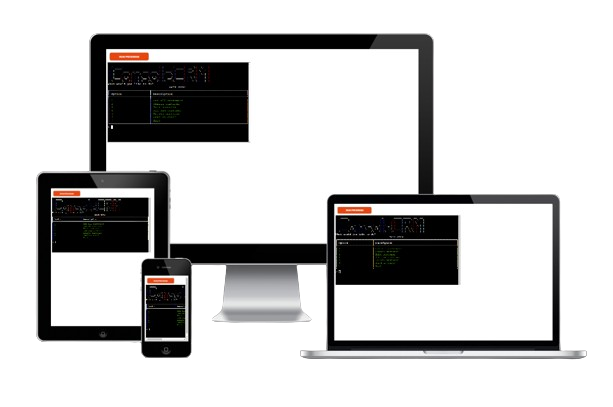

# Console CRM

Console CRM is a Python-based terminal application designed to manage customer relationships effectively. Integrated with the Google Sheets API, this tool offers essential CRM functions directly from the console, making it a versatile solution for businesses seeking a lightweight and accessible customer management system. The application is deployed on Heroku, ensuring it is always accessible and easy to use.

You can view and test the project [here](https://console-crm-23bb748056f0.herokuapp.com/)

## Project Rationale
Console CRM was developed to address the need for an accessible, efficient, and user-friendly customer relationship management system. By integrating essential CRM functions with the power of Python and Google Sheets, Console CRM aims to streamline customer management processes for businesses of all sizes.

### Key Project Goals:
-   **Simplifying Customer Management:** Provide a straightforward platform for businesses to manage customer information without the complexity of larger CRM systems.
-   **Enhancing Data Accessibility:** Utilize Google Sheets for easy data access, updates, and collaboration.
-   **Automating Routine Tasks:** Reduce the manual effort required to manage customer data, improving overall efficiency and accuracy.

### Target Audience

Console CRM is designed for a diverse range of users who need a reliable CRM solution:

-   **Small to Mid-Sized Businesses:** Companies looking for a cost-effective CRM solution that is easy to implement and use.
-   **Sales and Marketing Teams:** Professionals who need to manage customer interactions and track communications efficiently.
-   **Freelancers and Consultants:** Individuals who require a simple yet effective way to maintain client relationships and streamline their workflows.

By addressing the needs of these groups, Console CRM aims to become a vital tool in managing customer relationships, improving productivity, and fostering business growth.

### User Stories

#### Demographics
**Name:** Sarah Lee  
**Age:** 35  
**Occupation:** Marketing Manager  
**Location:** New York, NY

#### Background
Sarah is a marketing manager who oversees a team responsible for client relationships and campaign management. She values tools that enhance productivity and streamline communication, especially those that help maintain accurate customer records.

#### Motivations and Goals
**Efficiency:** Sarah aims to improve her team’s efficiency in managing customer data.  
**Automation:** She looks for ways to automate repetitive tasks like sending emails and updating customer information.  
**Accessibility:** Sarah needs a CRM system that she and her team can access from anywhere.  
**Accuracy:** Maintaining up-to-date and precise customer records is crucial for Sarah.

#### How Sarah Uses the Console CRM
**Customer Overview:** Regularly reviews all customer data to stay updated.  
**Customer Search:** Uses the search function to quickly locate specific customer details.  
**Editing Records:** Updates customer information to ensure records are current.  
**Adding Customers:** Adds new customers to keep the database comprehensive.  
**Deleting Records:** Removes obsolete or incorrect customer information.  
**Email Communication:** Sends emails directly from the CRM to streamline communication.

#### Why Sarah Loves the Console CRM
**Efficient Management:** Provides an organized way to handle customer data.  
**Time-Saving:** Automation features reduce the time spent on routine tasks.  
**Convenient Access:** Can be accessed from anywhere via Heroku.  
**Reliable Data:** Ensures customer records are always accurate and up-to-date.

#### Detailed User Journey
**Phase 1: Discovery**  
**Trigger:** Sarah learns about Console CRM from an industry webinar.  
**Research:** Visits the GitHub repository, explores the README, and watches a demo.  
**Decision:** Decides to deploy the app on Heroku for a trial run.

**Phase 2: Onboarding**  
**Setup:** Clones the repository and configures the Google Sheets API connection.  
**Tutorial:** Follows the provided setup instructions to get started.

**Phase 3: Daily Use**  
**Customer Management:** Uses the console to view, add, edit, and delete customer records.  
**Email Sending:** Utilizes the email feature for direct communication with customers.

**Phase 4: Optimization**  
**Feedback Loop:** Continuously updates and refines customer data based on team feedback.  
**Customization:** Adjusts CRM settings to better fit her team’s workflow.

**Phase 5: Advocacy**  
**Loyal User:** Becomes a regular user, appreciating the CRM’s efficiency and reliability.  
**Advocate:** Recommends Console CRM to other managers and industry peers.

#### User Benefits
**Streamlined Customer Management:**
- Efficiently manage customer data with intuitive console commands.

**Automation:**
- Automate routine tasks like sending emails and updating records.

**Accessibility:**
- Access customer data from anywhere using the Heroku platform.

**Real-Time Updates:**
- Ensure customer data is always current and accurate.

**User-friendly Experience:**
- Enjoy a smooth and intuitive interface designed for ease of use.
- Quickly get started with clear instructions and helpful prompts.

**Motivation and Rewards:**
- Experience the satisfaction of maintaining a well-organized customer database.
- Strive for efficient data management and seamless communication.

**Accessibility:**
- Access the CRM from various devices with internet connectivity.
- Easily manage customer data anytime, anywhere.

## Features

Console CRM offers a comprehensive set of features designed to streamline customer relationship management through an intuitive and efficient console-based interface. Here’s a breakdown of the key functionalities:

### Customer Management

-   **Add New Customers:** Easily add new customer records to the database, including essential contact information and notes.
-   **Edit Existing Customers:** Update customer details with new information to keep records current and accurate.
-   **Delete Customers:** Remove obsolete or incorrect customer entries to maintain a clean and relevant database.
-   **Search Customers:** Quickly locate customer records using powerful search functionality to find specific details swiftly.

### Data Integration and Accessibility

-   **Google Sheets Integration:** Seamlessly sync customer data with Google Sheets, ensuring easy access, updates, and collaboration.
-   **Real-Time Updates:** Perform customer operations with instantaneous updates, ensuring all users see the latest information without delay.
-   **Heroku Deployment:** Access the CRM from anywhere with an internet connection, thanks to its deployment on Heroku.

### Automation and Efficiency

-   **Automated Email Communication:** Send emails directly from the CRM, automating routine communication tasks and saving time.
-   **Data Validation:** Ensure data accuracy with built-in validation checks that prevent errors and inconsistencies.

### User-Friendly Interface

-   **Rich Text Formatting:** Utilize the `rich` library to enhance the console interface with colorful and styled text outputs for better readability.
-   **Intuitive Commands:** Access all CRM functionalities through simple and clear console commands, making it easy to navigate and use.

## Technologies Used

**Python:**  
Employed for backend logic, managing customer data, and interacting with APIs.

**Google Sheets API:**  
Used for storing, updating, and retrieving customer data efficiently.

**DataManager, Validator, MailManager:**  
Custom modules for handling data management, validation, and email operations.

**Heroku:**  
Platform for deploying the application, ensuring accessibility from any location.

**StackEdit:**  
Markdown editor used to create and format the README.md file.

**TAAG (Text to ASCII Art Generator):**  
Utilized for generating the ASCII logo for the application, available at [TAAG](https://patorjk.com/software/taag/).

### Data Storage
The Console CRM app employs Google Sheets for effective data storage and management. Here’s how the data is organized and utilized within the app:

**Customer Data:**
A worksheet named `contacts` contains all customer details, including names, contact information, and other relevant data. This organization ensures easy access and management of customer records.  

**Customer Operations:**
Each customer operation (add, edit, delete) is reflected in the `contacts` worksheet, ensuring that all changes are tracked and up-to-date.

### Data Management and Privacy Protection

**Seamless Google Sheets Integration:** Console CRM leverages the `gspread` library to provide seamless integration with Google Sheets, enabling users to manage customer data effectively. Authentication is managed using a service account, with credentials securely stored in a `creds.json` file. This file is purposefully kept out of the version control repository to ensure the highest level of security.

**Robust Data Privacy:** Ensuring data privacy is a cornerstone of Console CRM. All sensitive information, including service account details and API keys, are securely stored and kept confidential. This strategy protects user data from unauthorized access and ensures that the application maintains its integrity and trustworthiness.

**Dynamic Real-Time Updates:** Console CRM is designed to update customer data in real-time. As soon as any operation is performed, users can immediately see the most current information. This feature is essential for maintaining accurate and up-to-date records, ensuring that all users have access to the latest customer data without delay.

**Enhanced Security Protocols:** Access to the Google Sheets API is managed through OAuth2, which uses restricted scopes to limit access to only the necessary operations. This method enhances the security of data interactions within the app by minimizing exposure to potential security risks. By strictly controlling API permissions, Console CRM ensures that data exchanges are secure and confidential.

### Python Libraries Used
The Console CRM application relies on the following Python libraries for its functionality:

**time:**  
Provides functions for manipulating and formatting time-related data.

**json:**  
Enables parsing and generation of JSON data, facilitating data interchange.

**re:**  
Supports advanced string manipulation and regular expression operations.

**rich:**  
Enhances the user interface with rich text formatting, adding color and style to terminal outputs.

**smtplib, MIMEText, MIMEMultipart:**  
Enable email functionalities, allowing the application to send emails directly.

**DataManager (Custom Module):**  
Handles data management tasks within the application.

**Validator (Custom Module):**  
Performs data validation, utilizing `@staticmethod` for utility methods that don't require class instances.

**MailManager (Custom Module):**  
Manages email operations, integrating with the `smtplib` library.

**google-auth:**  
Manages authentication to Google APIs, securing access to Google Sheets.

**google-auth-oauthlib:**  
Facilitates OAuth 2.0 authentication flows for accessing Google Sheets.

**gspread:**  
Allows interaction with Google Sheets, used for storing and updating customer data.

These libraries and modules are essential for the application’s core functionalities and are listed in the `requirements.txt` file for easy installation using `pip`.
